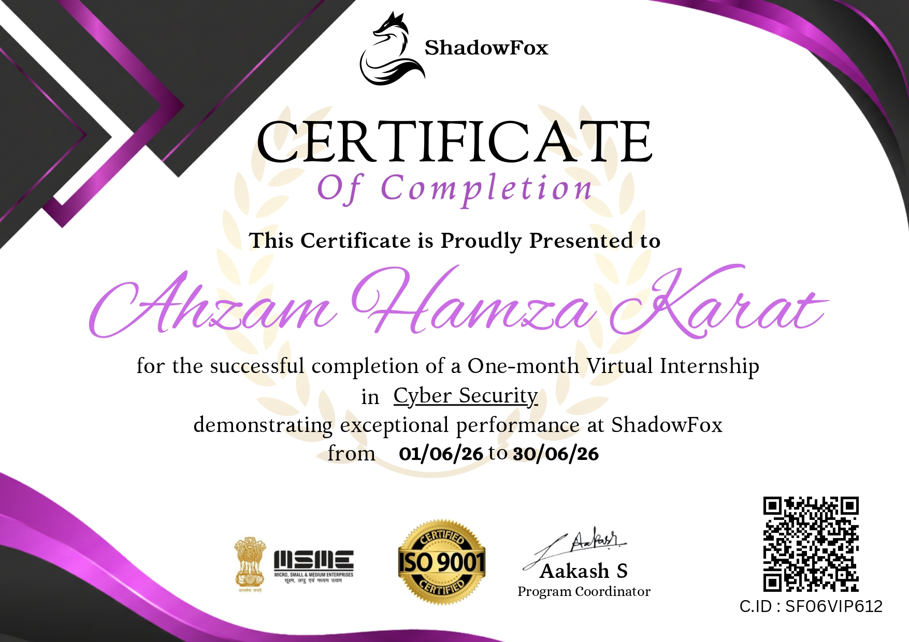

# ShadowFox Cybersecurity Internship

## About
This repository documents the work completed during my one-month Virtual Cyber Security Internship at ShadowFox (Program ID: SF-PID-2026-C1541), from 1st June 2026 to 30th June 2026.

## Tasks Completed

### Beginner Tasks
- **Port Scanning** — Nmap scan on testasp.vulnweb.com to find open ports and services
- **Directory Enumeration** — Gobuster brute force to discover hidden directories
- **Credential Interception** — Wireshark capture of plaintext HTTP login credentials

### Intermediate Tasks
- **Hash Cracking + VeraCrypt** — Cracked MD5 hash using CrackStation, mounted AES-encrypted volume
- **PE Analysis** — Used PE Explorer to find entry point of a Windows executable
- **Reverse Shell** — Generated Meterpreter payload using msfvenom, established reverse shell via Metasploit

### Hard Task (Personal Learning — Completed Post-Submission)
- **TryHackMe Basic Pentesting** — Completed full penetration test including enumeration, brute forcing, SSH key cracking, and privilege escalation. Done independently after official submission for hands-on practice.

## Tools Used

### Internship Tasks
| Tool | Purpose |
|------|---------|
| Nmap | Port scanning and service enumeration |
| Gobuster | Directory brute forcing |
| Wireshark | Network traffic analysis |
| CrackStation | MD5 hash cracking |
| VeraCrypt | Encrypted volume mounting |
| PE Explorer | Executable static analysis |
| Metasploit | Reverse shell payload and handler |

### TryHackMe Basic Pentesting
| Tool | Purpose |
|------|---------|
| Hydra | SSH brute force attack |
| John the Ripper | SSH private key passphrase cracking |

## Certificate

Certificate ID: SF06VIP612
Issued by: ShadowFox | Signed by: Aakash S, Program Coordinator

## Author
**Ahzam Hamza Karat**
B.Tech Cybersecurity — Karunya Institute of Technology and Sciences (2024-2028)
